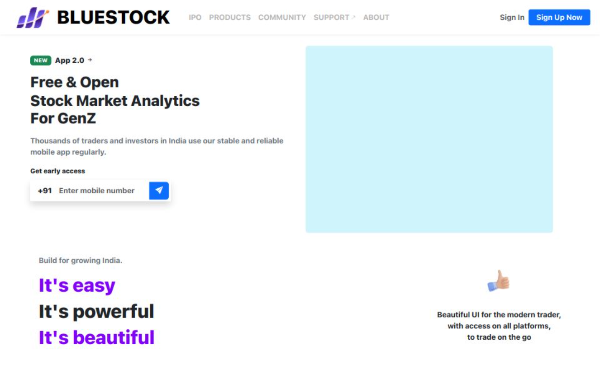

<h1 align="center" style="color:#2c3e50;">💹 Bluestock Fintech</h1>

<p align="center">
  
</p>

<p align="center">
  <b>A sleek, production-ready frontend for Bluestock's IPO analytics platform.</b><br>
  Built with Angular & Bootstrap, this app offers real-time IPO insights, tracking, and document access.
</p>

---

## 📄 About the Project

Bluestock is a production-level frontend application built for Bluestock Fintech.  
It displays IPO data in a clean, responsive interface — helping investors track public offerings.  
This app powers both our platform and client dashboards with structured IPO insights.

---

## 🌟 Features

- 📊 **Detailed IPO Listings**  
  Company logo, name, price band, issue type and size, key dates, listing gains & status.

- 📈 **Live Market Metrics**  
  IPO price, listing price, current CMP, and auto-calculated returns.

- 📎 **Downloadable Documents**  
  Instant access to RHP and DRHP PDFs for every IPO.

- 💻 **Responsive UI**  
  Fully optimized for both desktop and mobile screens.

- 🌐 **Easy Embeds for Clients**  
  Designed for integration into third-party apps and platforms.

---

## 🛠️ Tech Stack

> This repository contains the **frontend only**.

- 🎯 **Framework:** Angular (standalone components)
- 🎨 **Styling:** Bootstrap 5
- 🧩 **Icons & Assets:** Bootstrap Icons, Custom Assets
- 🔗 **API:** Connected to Bluestock’s secure REST API

---

## 🚀 Live Demo

🌐 **App Link:**  
[🔗 Bluestock-Fintech.app](https://Bluestock-Fintech.app/)

---

## 📁 Project Structure

bluestock-frontend/
├── src/
│ ├── app/
│ │ ├── components/
│ │ ├── services/
│ ├── assets/
│ │ ├── Github-Images/
│ │ │ └── Preview-Image.png
│ └── index.html
├── angular.json
├── package.json

---


---

## ⚙️ Getting Started

### 1️⃣ Clone the Repository

```bash
git clone https://github.com/rockyhans/Bluestock-Fintech.git
cd bluestock-frontend

  
2️⃣ Install Dependencies

npm install

### 3. Run the App Locally
npm start / ng serve

### 🌍 Hosting Info
The frontend is hosted on Verce - [[ Bluestock Fintech - IPO Web Application](https://Bluestock-Fintech.app/)]

### 👥 Contributors
👤 <h2> Danish Rizwan </h2> – Frontend Developer
💼 Bluestock Fintech Team

📬 Contact
For questions
📧 rdanishrizwan@example.com
